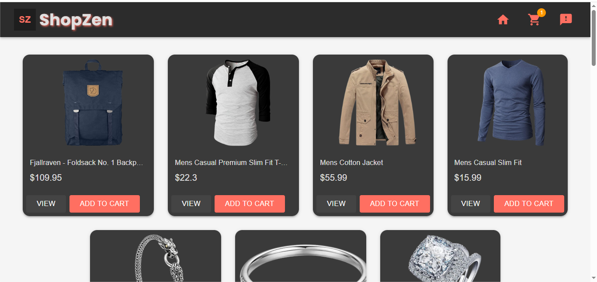
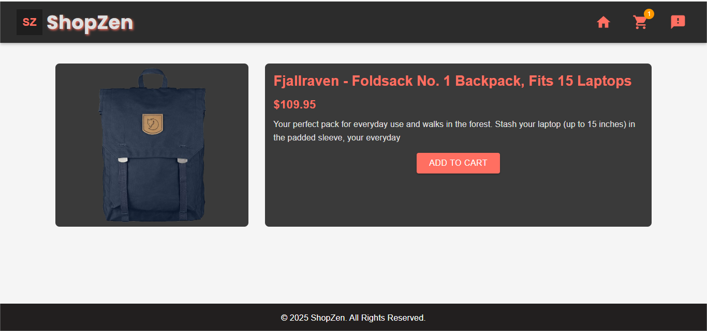
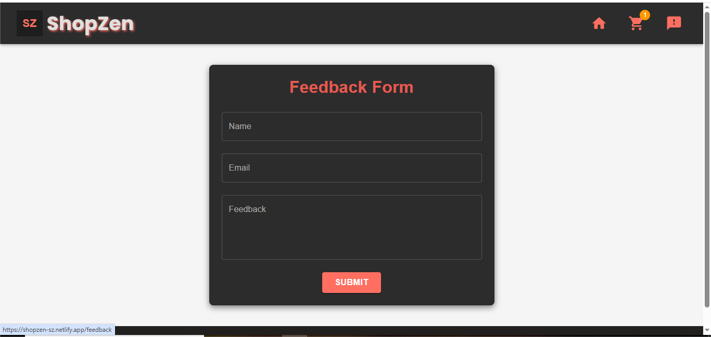

# ShopZen

A modern e-commerce web application built with **React**, **Redux Toolkit**, and **Material-UI**, featuring a shopping cart, product details, order summary, and feedback form.

---

## 🚀 Features

- Browse products fetched from [Fake Store API](https://fakestoreapi.com/)
- View product details and images
- Add/remove items from the cart
- Place orders with a summary form
- Submit feedback using a React Hook Form with validation
- Persistent cart using **localStorage**

---

## 🛠️ Tech Stack

- **React 18**
- **Redux Toolkit**
- **React Router v6**
- **Material-UI**
- **SweetAlert2** for notifications
- **React Hook Form + Yup** for form validation
- **CSS / SCSS** for styling

---

## ⚡ Getting Started

### 1️⃣ Clone the repo

```bash
git clone https://github.com/praveena272004/shopzen.git
```

### 2️⃣ Install dependencies

```bash
cd shopzen
npm install
```

### 3️⃣ Run the app

```bash
npm run dev
```
👉 Open your browser at:http://localhost:5173

---

## 🌐 Live Demo

Check out the live version of the app here: [ShopZen](https://shopzen-sz.netlify.app/) 

---

📸 Screenshots

🛍️ Product List


📦 Product Details


🛒 Cart


✔️ Order Summary


💬 Feedback Form


---

🚀 Future Improvements

- Integrate payment gateway for real transactions 💳
- Enable product categories & filters 🛍️
- Create an admin dashboard 📊
- Add dark/light theme toggle 🌙☀️
---

## 📜 License

This project is licensed under the [MIT License](LICENSE).

---

👤 Author

Praveena M – [GitHub](https://github.com/praveena272004)
